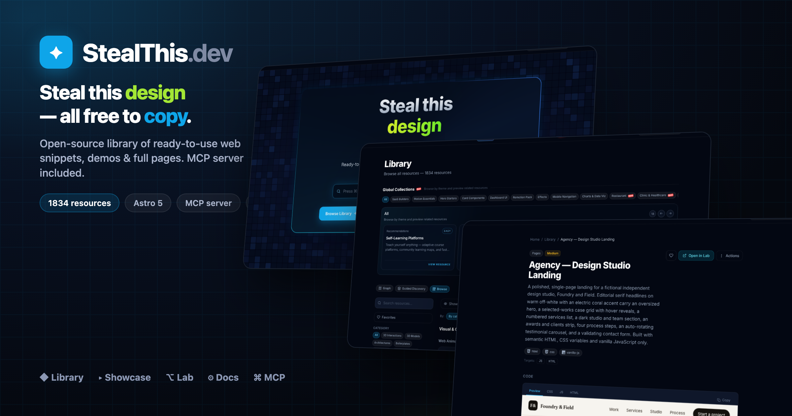

# StealThis.dev



StealThis.dev is a Bun-workspace monorepo for an open-source resource library of reusable web implementations:

- Showcase site (`www`) for browsing and copying resources
- Documentation site (`docs`) with Starlight guides
- Full-screen demo runner (`lab`) for runnable snippets
- Project graph explorer (`build`) for planning implementations
- DB visualizer (`dbviz`) for relational schema commands and diagrams
- MCP server (`mcp`) to expose the catalog to AI tools
- Remotion app (`remotion`) for animation/video compositions

The canonical source of resource content lives in `packages/content/resources/<slug>/`.

## Website Locales

`apps/www` currently exposes these localized routes:

- `en` — English
- `es` — Spanish
- `fr` — French
- `ar` — Arabic
- `ja` — Japanese
- `ms` — Malay
- `hi` — Hindi
- `ko` — Korean
- `nl` — Dutch
- `de` — German
- `pt-br` — Brazilian Portuguese
- `zh-hk` — Traditional Chinese (Hong Kong)
- `zh-cn` — Simplified Chinese (China)
- `de-ch` — Swiss German
- `it` — Italian
- `pl` — Polish
- `ru` — Russian
- `uk` — Ukrainian

Browser locale detection also maps `RU` users to `ru` and `UA` users to `uk`.

## Monorepo Structure

```text
.
├── apps
│   ├── www        # Astro 5 showcase + library
│   ├── docs       # Astro + Starlight docs
│   ├── lab        # Full-screen demo runner (iframe srcdoc)
│   ├── build      # Astro + React graph builder
│   ├── dbviz      # Astro + React database visualizer
│   ├── mcp        # Hono + Cloudflare Worker MCP server
│   └── remotion   # Remotion compositions
├── packages
│   ├── content    # Source-of-truth resources and docs
│   ├── schema     # Zod schema + loaders/types
│   └── config     # Shared tsconfig/tailwind presets
└── scripts        # Import + vendor sync utilities
```

## Tech Stack

- Bun workspaces
- Astro 5 (multi-app)
- Starlight (docs)
- React (builder/remotion integrations)
- Tailwind CSS
- Hono + Wrangler (Cloudflare Worker for MCP)
- Zod + gray-matter + fast-glob (content schema/loading)
- Biome (lint/format)

## Local Prerequisites

- [Bun](https://bun.sh/) installed
- Node-compatible environment for Wrangler/Remotion tooling

## Quick Start

```bash
# from repo root
bun install
```

Run any app independently:

```bash
bun run dev:www      # http://localhost:4321
bun run dev:docs     # http://localhost:4322
bun run dev:lab      # http://localhost:4323
bun run dev:build    # http://localhost:4324
bun run dev:dbviz    # http://localhost:4327
bun run dev:mcp      # http://localhost:8787 (Wrangler)
bun run dev:remotion # http://localhost:4325
```

## Root Scripts

```bash
# development
bun run dev:www
bun run dev:docs
bun run dev:lab
bun run dev:build
bun run dev:dbviz
bun run dev:mcp
bun run dev:remotion

# builds
bun run build         # www + docs + lab + build + styleforge + dbviz + mcp
bun run build:www
bun run build:docs
bun run build:lab
bun run build:build
bun run build:dbviz
bun run build:mcp
bun run build:remotion

# quality
bun run lint
bun run format

# content/catalog tooling
bun run sync:vendor
bun run import:examples
bun run --filter @stealthis/mcp catalog
```

## Production URLs

- Main site: [https://stealthis.dev](https://stealthis.dev)
- Docs: [https://docs.stealthis.dev](https://docs.stealthis.dev)
- Lab: [https://lab.stealthis.dev](https://lab.stealthis.dev)
- Builder: [https://build.stealthis.dev](https://build.stealthis.dev)
- DBViz: [https://dbviz.stealthis.dev](https://dbviz.stealthis.dev)
- MCP: [https://mcp.stealthis.dev/mcp](https://mcp.stealthis.dev/mcp)

## Resource Content Model

Each resource is a self-contained folder:

```text
packages/content/resources/<slug>/
├── index.mdx
└── snippets/
    ├── html.html
    ├── style.css
    ├── script.js
    └── react.tsx (optional, plus other targets)
```

If a resource should appear in Lab:

- Set `labRoute: /<category>/<slug>` in frontmatter
- Provide `html.html`, `style.css`, and `script.js`

Supported category IDs:

- `web-animations`
- `web-pages`
- `ui-components`
- `patterns`
- `components`
- `pages`
- `prompts`
- `skills`
- `mcp-servers`
- `architectures`
- `boilerplates`
- `remotion`

## Add a New Resource

1. Create `packages/content/resources/<slug>/index.mdx` with valid frontmatter.
2. Add snippets in `packages/content/resources/<slug>/snippets/`.
3. If runnable in Lab, add `labRoute` and include HTML/CSS/JS snippets.
4. Regenerate MCP catalog:

```bash
bun run --filter @stealthis/mcp catalog
```

5. Validate:

```bash
bun run lint
bun run build:www
bun run build:lab
bun run build:mcp
```

## Building a Whole Phase (multi-agent workflow)

The [`ROADMAP.md`](./ROADMAP.md) is organized into **phases**, each a themed vertical with
20–35 resources (Clinic, Gym, Salon, Real Estate, …). Building those one by one is slow, so
the repo has a documented pattern for generating a whole phase with a **parallel multi-agent
`Workflow`** in Claude Code — one subagent per resource, running concurrently.

To kick off the next phase, just ask Claude Code in plain language **including the keyword
`workflow`** (that keyword is what authorizes the multi-agent run — without it, Claude builds
by hand). For example:

```
finish Phase 30 (Gym) of the ROADMAP using a workflow
```

Claude then automatically:

1. Reads [`PHASE-WORKFLOW.md`](./PHASE-WORKFLOW.md) (the full how-to) and the Phase 30 table in `ROADMAP.md`.
2. Studies the pattern by opening a finished resource (e.g. `clinic-appointment-list`) to match structure/quality.
3. Wires the new collection (`gym`) in the 4 places it must exist (schema enum, `apps/www/src/content/config.ts`, `apps/www/src/lib/collections.ts`, i18n strings).
4. Builds the `SPECS` list (one entry per resource) from the roadmap table.
5. Launches the workflow — a subagent per resource, in parallel (watch live with `/workflows`).
6. Regenerates the MCP catalog and ticks the ROADMAP checkboxes.

Handy add-ons you can append to the request:

| If you want… | Say… |
|---|---|
| It to stop for review when done | "…**and pause** when Phase 30 is done" |
| Several phases back-to-back | "finish **Phases 30, 31 and 32** with workflows, one after another" |
| To limit scope | "only sections **30.A and 30.B**" or "only the **5 landings**" |
| To recover after a cutoff (e.g. session limit) | "**resume** the workflow" → re-runs only what failed; finished ones return from cache for free |

> A workflow spins up dozens of agents — fast in wall-clock but token-heavy. Worth it for 20+
> resources; for 1–3, build by hand (see [Add a New Resource](#add-a-new-resource)). Full
> mechanics, the script template, and how to read `/workflows` live in
> [`PHASE-WORKFLOW.md`](./PHASE-WORKFLOW.md).

## Schema + Consumer Alignment

If you add/rename category/type/target fields, keep these in sync:

- `packages/schema/src/schema.ts`
- `packages/schema/src/types.ts`
- `apps/www/src/content/config.ts`
- `apps/www/src/i18n/index.ts` (labels/filters)

## MCP Server

The MCP Worker serves a generated catalog (`apps/mcp/src/catalog.json`) built from `packages/content`.

Important commands:

```bash
# regenerate catalog after content changes
bun run --filter @stealthis/mcp catalog

# local worker
bun run dev:mcp

# validate worker bundle
bun run build:mcp
```

Primary endpoints:

- `POST /mcp` (MCP JSON-RPC transport)
- `GET /tools/list_resources`
- `GET /tools/get_resource/:slug`
- `GET /tools/get_snippet/:slug/:target`
- `GET /tools/search?q=...`
- `GET /tools/get_lab/:slug`

## Codebase Graph (graphify)

[graphify](https://pypi.org/project/graphifyy/) turns this repo into a **local, queryable knowledge graph** of how apps, modules, and docs connect. Output lands in `graphify-out/` — that folder is **gitignored** (cache, JSON, HTML, reports). Regenerate on your machine or in a separate checkout; do not commit it.

Requires the graphify skill/CLI (e.g. `/graphify` in Claude Code, or `uv tool install graphifyy`).

### Build and refresh

```bash
/graphify apps              # Full extraction on apps/ (~2k nodes, 3k edges on last run)
/graphify apps --update     # Incremental — only new/changed files (fast after first run)
/graphify apps --cluster-only   # Re-run community detection on existing graph.json
/graphify apps --mode deep      # More aggressive INFERRED edges (slower, richer graph)
/graphify apps --directed       # Preserve edge direction (source → target) for call tracing
/graphify packages/content  # Narrow scope to content package only
/graphify apps --watch      # Auto-rebuild on file changes (no LLM, graph structure only)
```

After a full build, open `graphify-out/graph.html` in a browser for the interactive view, or read `graphify-out/GRAPH_REPORT.md` for community hubs, god nodes, and import cycles.

### Explore without rebuilding

These read the existing `graphify-out/graph.json` — no token cost if the graph is already built:

```bash
/graphify query "How does the MCP catalog get built?"
/graphify query "What connects ResourceCard to i18n?" --dfs      # Trace one path (depth-first)
/graphify query "How does lab inline snippets?" --budget 1500      # Cap answer length
/graphify path "ForceGraph" "useI18n"                              # Shortest path between two nodes
/graphify explain "DbVizStudioInner"                               # Plain-language node summary
```

### Optional exports

```bash
/graphify apps --svg            # graph.svg (Notion, GitHub embeds)
/graphify apps --graphml        # graph.graphml (Gephi, yEd)
/graphify apps --neo4j          # graphify-out/cypher.txt for Neo4j import
/graphify apps --obsidian       # Obsidian vault (one note per node)
/graphify apps --wiki           # Agent-crawlable wiki (index + articles)
/graphify apps --no-viz         # Skip HTML — report + JSON only
```

### What belongs in git vs locally

| Keep in repo (stable) | Local only (`graphify-out/`, gitignored) |
|---|---|
| App inventory under `apps/` | `cache/` extraction cache |
| Content flow: `packages/content` → www/lab collections + `apps/mcp` catalog | `graph.json`, `graph.html`, `manifest.json`, `cost.json` |
| Cross-app hubs: `useI18n()`, `ResourceCard.astro`, `ForceGraph`, per-app shells | `GRAPH_REPORT.md`, community labels, Obsidian/wiki exports |

Full flag list: `/graphify --help`.

## Workspace Notes

- Do not edit generated output in `dist/` or `graphify-out/`.
- Prefer reusing shared modules from `packages/schema` and `packages/config`.
- Use Bun commands across the monorepo (project standard).
- For app-specific docs:
  - `apps/mcp/README.md`
  - `apps/remotion/README.md`

## Deployment (Cloudflare)

Current deployment workflow uses:

- Cloudflare Pages for `www`, `docs`, `lab`, `build`
- Cloudflare Workers for `mcp`

Reference commands are documented in `COMMANDS.md`.

## Repository Health Checks

For routing/UI smoke tests after local dev starts:

```bash
curl -s -o /dev/null -w "%{http_code}" http://localhost:4321/
curl -s -o /dev/null -w "%{http_code}" http://localhost:4321/library
curl -s -o /dev/null -w "%{http_code}" http://localhost:4323/
curl -s -o /dev/null -w "%{http_code}" http://localhost:4323/<category>/<slug>
```

## Supply-Chain Security

This repo is hardened against malicious dependency updates: a 3-day install
cooldown (`minimumReleaseAge`), a Socket pre-install scanner, and blocked
postinstall scripts by default. Full explanation in **`SUPPLY_CHAIN_SECURITY.md`**.

**Verify the project is not compromised** — runs every defense check, scans for
known CVEs and blocked install scripts, and writes a timestamped report to
`SECURITY_REPORT.md`:

```bash
bun run security:verify
```

Run it **before pulling new dependencies, before a deploy, and routinely**.
Exit code is non-zero only when a *defense layer* is broken (the real "repo no
longer hardened" signal); known transitive CVEs do not fail it.

```bash
bun run audit            # bun audit — known CVEs in the lockfile
bun run outdated         # outdated deps across all workspaces
bun run security:trust   # review blocked postinstall scripts
```

For prioritized triage of what to update vs. what is still inside the cooldown
window, run the **`/pkg-audit`** command.

## License

Resources default to `MIT` via frontmatter metadata.  
If you need a repository-wide license, add a top-level `LICENSE` file.
