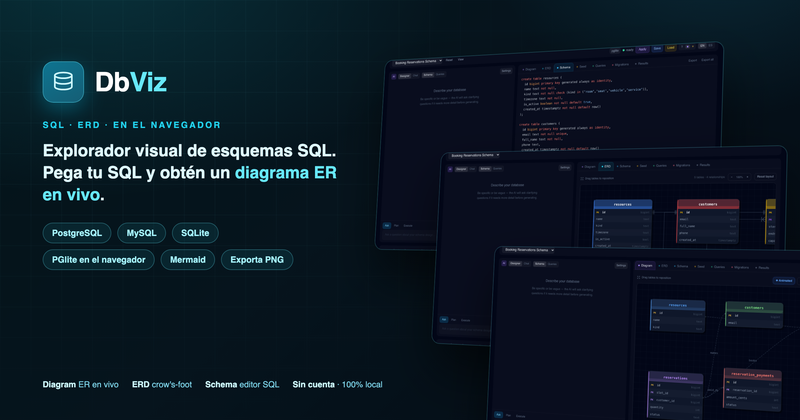

# DbViz



**Visual database schema explorer.** Paste a SQL schema, get a live ER diagram — design
tables, generate ERDs, and run queries right in the browser. No account, 100% local: the
database runs in-page via [PGlite](https://github.com/electric-sql/pglite) (WASM Postgres).

Live: **[dbviz.stealthis.dev](https://dbviz.stealthis.dev)**

## What it does

- **Diagram** — a live ER diagram of your schema; drag tables to reposition, FKs render as relations.
- **ERD** — crow's-foot notation view.
- **Schema** — SQL editor; write `CREATE TABLE` (PostgreSQL / MySQL / SQLite dialects).
- **Seed / Queries** — insert sample data and run SQL against the in-browser database.
- **Migrations / Results** — track changes and inspect query output.
- **Export** — download the diagram as PNG or copy a shareable link.

## Tech

Astro 5 (static) · React 18 islands · Tailwind 3 · PGlite (in-browser Postgres) ·
Mermaid (diagrams) · deployed on Cloudflare.

## Development

From the monorepo root:

```bash
bun run dev:dbviz      # or: bun run --filter @stealthis/dbviz dev
```

Runs at **http://localhost:4327**.

```bash
bun run --filter @stealthis/dbviz build      # production build
bun run --filter @stealthis/dbviz preview    # preview the build
```

## Regenerating the hero banner

The banner is built from **real screenshots** of the running app, composed with the
[`/hero-banner`](../../.claude/skills/hero-banner) skill. To refresh it, run the dev
server and re-run the skill against this directory — output lands at `assets/hero.png`.

---

Part of the [StealThis](https://stealthis.dev) suite.
