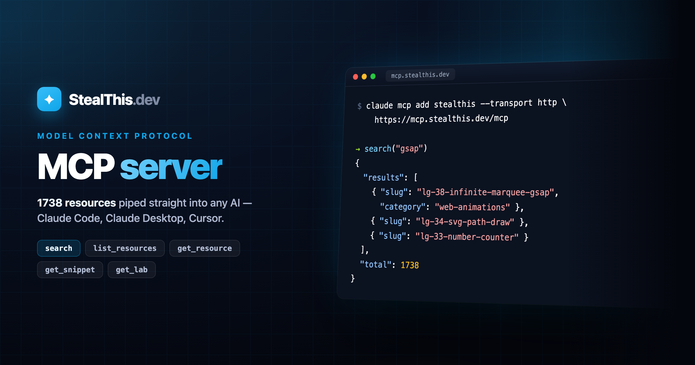

# StealThis MCP Server



REST API + MCP server for the StealThis.dev resource library.

- **Production:** `https://mcp.stealthis.dev`
- **Local:** `http://localhost:8787`
- **How it works guide:** `./HOW_IT_WORKS.md`

---

## Setup in MCP clients

### Claude Code (CLI)

```bash
# Add the server (one time only)
claude mcp add stealthis --transport http https://mcp.stealthis.dev/mcp

# Verify it is active
claude mcp list
```

Local during development:
```bash
claude mcp add stealthis-local --transport http http://localhost:8787/mcp
```

---

### Claude Desktop

Edit `~/Library/Application Support/Claude/claude_desktop_config.json` (macOS):

```json
{
  "mcpServers": {
    "stealthis": {
      "type": "http",
      "url": "https://mcp.stealthis.dev/mcp"
    }
  }
}
```

Restart Claude Desktop. The tools show up automatically.

---

### Cursor

In **Settings → MCP** (or `~/.cursor/mcp.json`):

```json
{
  "mcpServers": {
    "stealthis": {
      "type": "http",
      "url": "https://mcp.stealthis.dev/mcp"
    }
  }
}
```

---

## Available tools

Once configured, the AI can call these tools directly:

| Tool | Description |
|------|-------------|
| `list_resources` | Lists all resources. Filters by `category`, `difficulty`, `tech`. |
| `get_resource` | Full metadata for a resource by `slug`. |
| `get_snippet` | Source code for a specific target (`html`, `css`, `js`, `react`, `vue`…). |
| `search` | Searches resources by keyword across title, description, tags, and tech. |
| `get_lab` | URL of the full-screen demo on lab.stealthis.dev. |

### Chat usage examples

```
Show me all the easy web animation resources
→ list_resources(category: "web-animations", difficulty: "easy")

Give me the React code for scroll-fade
→ get_snippet(slug: "scroll-fade", target: "react")

Search for resources using GSAP
→ search(query: "gsap")

Is there a demo for glass-card?
→ get_lab(slug: "glass-card")
```

---

## REST API (direct access without MCP)

For use from scripts, `fetch`, or curl:

```bash
# List resources
curl https://mcp.stealthis.dev/tools/list_resources
curl https://mcp.stealthis.dev/tools/list_resources?category=web-animations&difficulty=easy

# Get a resource
curl https://mcp.stealthis.dev/tools/get_resource/scroll-fade

# Get a code snippet
curl https://mcp.stealthis.dev/tools/get_snippet/scroll-fade/react
curl https://mcp.stealthis.dev/tools/get_snippet/glass-card/css

# Search
curl https://mcp.stealthis.dev/tools/search?q=parallax

# Lab URL
curl https://mcp.stealthis.dev/tools/get_lab/glass-card
```

---

## Local development

```bash
# 1. Generate the catalog (only when content changes)
bun run --filter @stealthis/mcp catalog

# 2. Start the worker
bun run dev:mcp
# → http://localhost:8787
```

> **Note:** `bun run dev:mcp` does NOT regenerate the catalog automatically.
> If you add or edit resources in `packages/content`, run step 1 first.

---

## Deploy

```bash
bun run --filter @stealthis/mcp catalog  # regenerate catalog
bun run --filter @stealthis/mcp build    # dry-run
bun run --filter @stealthis/mcp deploy   # wrangler deploy
```

---

## How it works internally

- **Protocol:** MCP Streamable HTTP (`POST /mcp`) — compatible with Claude Code, Claude Desktop, Cursor, and any MCP client with HTTP support.
- **Data:** The catalog (`src/catalog.json`) is generated at build time with every resource and its code snippets. No disk reads at runtime.
- **Transport:** No SSE — responses are synchronous JSON (enough for tools without streaming).
